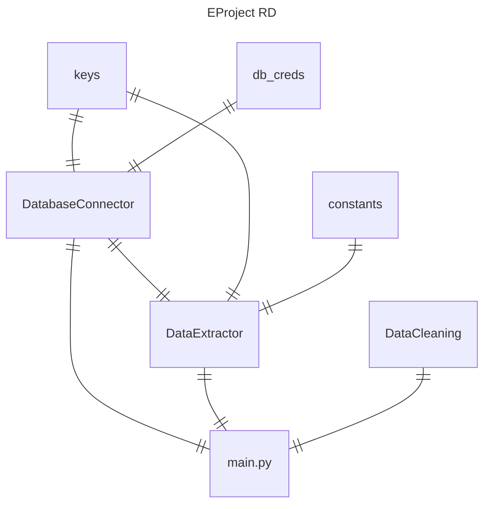

# Multinational Retail Data Centralisation

This repo contains Python scripts for the AICore RDS project, June 2024.

### Table of Contents

* [Outline of the project](#outline-of-the-project)
* [Installation](#installations-needed)
* [Structure of the code](#structure-of-the-code)
* [Other files](#other-files)
* [Usage](#usage)

## Outline of the project

The purpose of this code is to scrape data from a number of distinct legacy sources and centralise everything onto a single RDBMS after cleaning.

Specifically, data is to be ingested from a PDF file (containing credit card information) in an AWS S3 bucket, from an AWS RDS database (where legacy user information can be found), and from an URL address (physical store information) to be accessed via an API.

When the data is extracted and converted into Pandas DataFrame format it is then cleaned before being sent to a local database management system operated by the user.

### Dependencies: 

`pandas`
&nbsp; `tabula`
&nbsp; `requests`
&nbsp; `boto3`
&nbsp; `PyYAML`
&nbsp; `sqlalchemy`
&nbsp; `psycopg2`

## Structure of the code

The project builds three classes.

* `DatabaseConnector`** (`database_util.py`)

* `DataExtractor`** (`data_extraction.py`)

* `DataCleaning`** (`data_cleaning.py`) 

The scripts reference a number of external `yaml` files.

* `db_creds.yaml`, wherein are stored credentials to access the AWS RDB.
* `keys.yaml`, containing other credentials such as the user's database password and PI keys.
* `constants.yaml`, which stores the URL endpoint and S3 location. 

**Licence**: A. Close 2024